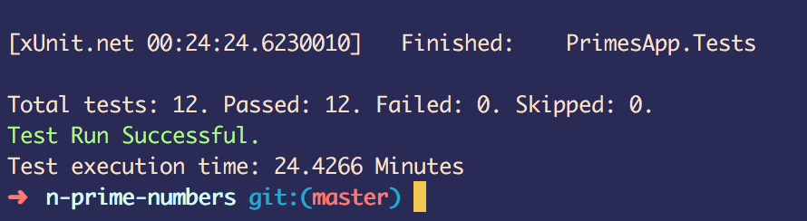
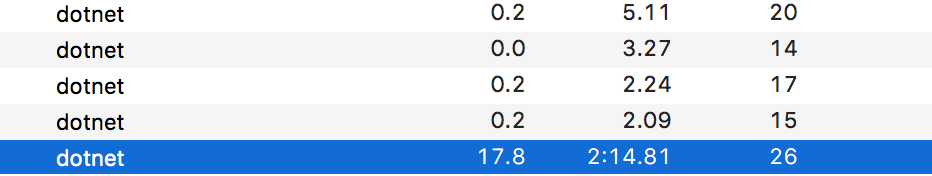
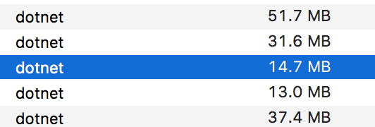

# n-prime-numbers

## Introduction 
This is a .net core project that given the input `n` will generate the first `n` prime numbers. I'm using .NET Core as I've been meaning to learn it since it was released a few years ago. All my previous C# experience has been using old ASP.NET or for games, so this should be interesting. It will also allow me to learn more about unit testing.

This project took me at most 8 hours, spread out over 3 days. A lot of those hours were just learning about .NET Core, configuring the project project files and Unit Testing, all of which I can see making it's way into other projects I create in the future.

## Installation

 - Download .NET Core for your prefered operating system [from here](https://www.microsoft.com/net/core).
 - Clone the repo to your machine.
 - Open a terminal to this projects directory
 - Run `dotnet test` to validate that the tests all pass. They should!

## Running the program

 - Ensure your terminal is set to this project directory.
 - Run `dotnet build`
 - Run `dotnet run --project ./PrimesApp.Console/PrimesApp.Console.csproj NUMBER` where `NUMBER` is the amount of primes you'd like to find.
 - You can optionally add `-csv` to the end of the command and a CSV file will be saved to the `csv-files` directory instead. 
    - This is preferable when `NUMBER` is greater than 20 because terminal output starts to get garbled after that. 
    - The CSV output is also much faster to execute because printing out `NUMBER` lines to the terminal quickly starts to slow down.

## What am I happy with?

I enjoyed working with .NET Core in this project and learning about Unit Testing. I think the code is clear in it's intent and syntax. I also really like the separation of the library, console and tests projects. It was a bit fiddly but I knew it would be worth putting in the time to do so. I really live the CsvSaver.cs file (though maybe not it's name) as I think it's elegant in it's use of LINQ and String.Join to simplify the creation of rows. That's something I'll be reusing again in the future.

## What am I unhappy with?

I'm unhappy with my unit testing practices. This is the first project where I've used them outside of a hello world, and whilst I've read about or listened to podcasts at length about their value and uses I know that I could do a far better job with more experience. The biggest offender is the PrimesApp_Rendering.cs class because it doesn't actually test and returned output. The problem is I couldn't come up with a way to render up to 20,000 primes in a grid AND return it all in 1 string due to running out of memory. My approach was to print each row of the grid as it was finished but this isn't testable. I considered return an array of strings, each element being a row, but it still has the same problem. All I can think of is creating separate methods for rendering big grids that isn't testable and smaller grids that is testable and calling the appropriate one in business logic. But this results in needless repeated code which isn't desirable. I'm going to think about how I could overcome this for a few days and maybe update it, but for now I'm not happy with it.

## Output

It currently generates up to 20,000 prime numbers in no time at all.  

Here's a gif of the program running on my Macbook Pro (2015) working through printing a grid of first 20,000 primes, row by row.

Generating a grid and displaying it line by line took a long time on the Mac...

On the Mac it has no more than 20% CPU usage, though Activity Monitor routinely shows programs going above 100% so I'm not sure what it's actually measuring...

The RAM usage on Mac is shown below, though there are many processes and only 1 of them is from my application. I'd hazard a guess that I'm using 50mb or RAM

Generating the CSV file was much quicker, taking maybe 20 seconds for a 20,000 by 20,000 file, and used the following resources on my Windows machine (i7-6700HQ) 

## Notes during development

 - I remember reading about a ~~mendel sieve~~ [Sieve of Eratosthenes](https://en.wikipedia.org/wiki/Sieve_of_Eratosthenes) algorithm, maybe that's appropriate?
 - Write tests first, then write the minimum code required to pass that test.
    - This means adding things like checking for the right sort of input etc. comes AFTER writing the tests for business logic and the code that passes the test.
 - The [Fact] attribute is cool for the Xunit testing library, but [Theory] is cooler!
 - What's a good way to find up to 20,000 primes, per the requirements, without putting the business logic in the tests? Would the code required to make writing tests easier make normal business logic harder to write?

 - When rendering a grid of 20,000 prime numbers StringBuilder reaches 4GB of memory before the program crashes. 
 `Error Message: System.OutOfMemoryException : Insufficient memory to continue the execution of the program.`
 - ~Compare against the other text writing options.~ Output the StringBuilder after each line, then clear it.
 - Large grids are garbled in the terminal, so outputting to a csv file would also be great.
 - I need to make the output methods more testable
 - Make a nice github pages site for this? Why not.

